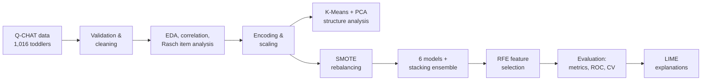
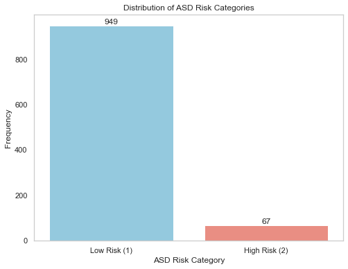
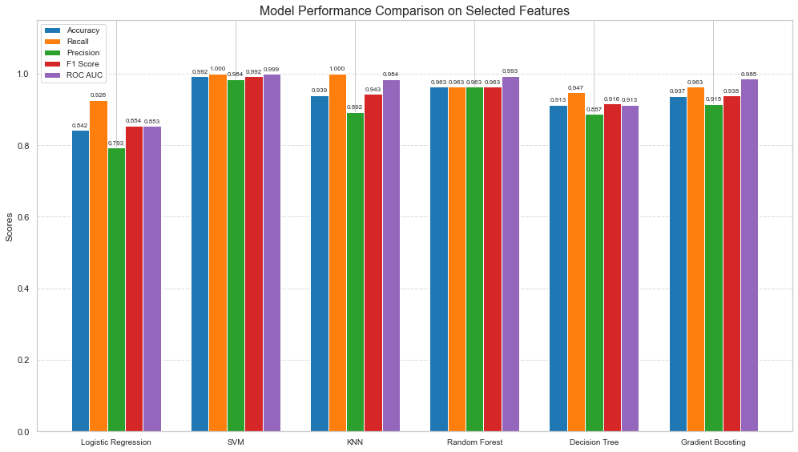
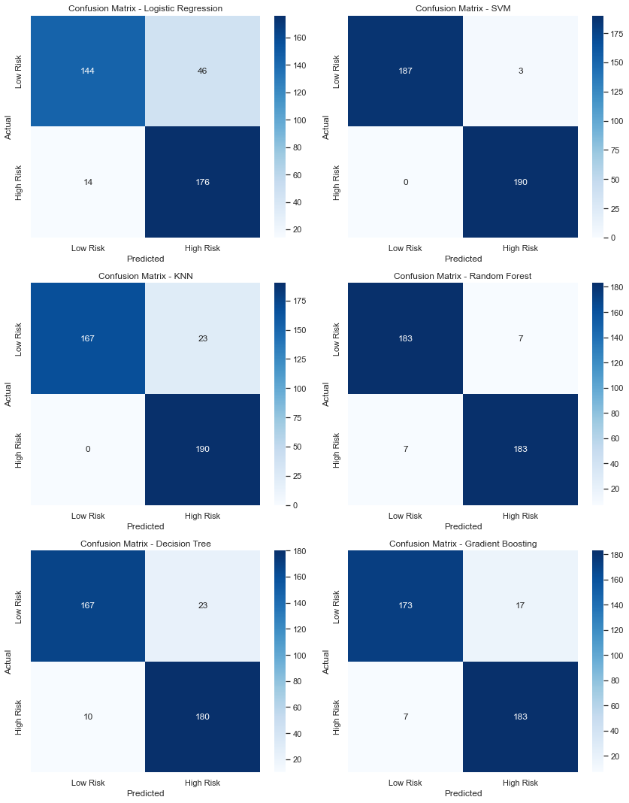
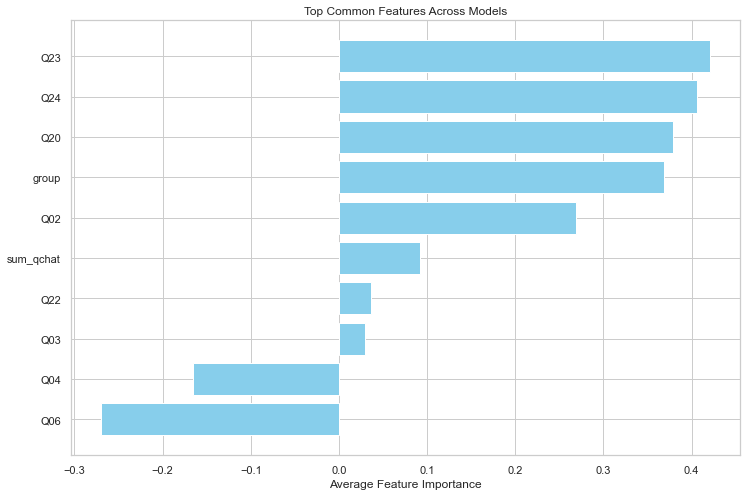
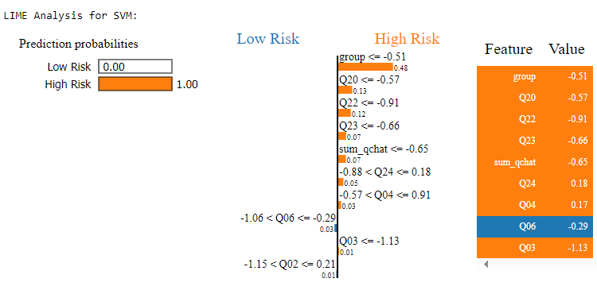

# 🧩 Early Autism Risk Detection in Toddlers with Machine Learning

**MSc Big Data Analytics dissertation (Distinction), University of Derby, 2023–24**
Supervisor: Dr Mohsen Farid

An end-to-end machine learning pipeline that classifies autism spectrum disorder (ASD) risk in toddlers from the **Q-CHAT** (Quantitative Checklist for Autism in Toddlers) screening questionnaire. The aim was a model that is both accurate and **explainable to clinicians**, so every prediction comes with a LIME explanation of which answers drove it.

**Tools:** Python · pandas · NumPy · scikit-learn · imbalanced-learn (SMOTE) · LIME · Matplotlib · Seaborn · Jupyter

---

## Highlights

- **7 classifiers benchmarked** in one evaluation framework: Logistic Regression, SVM, KNN, Decision Tree, Random Forest, Gradient Boosting and a Stacking ensemble. Each was scored on accuracy, precision, recall, F1, ROC AUC and 5-fold stratified cross-validation.
- **Best model (SVM after feature selection): 99.2% accuracy, 98.4% precision, 100% recall, ROC AUC 0.999** on the held-out test set, with zero missed high-risk cases.
- **Recursive Feature Elimination cut SVM errors by 75%** (12 → 3 misclassifications).
- **Stacking ensemble** with a Logistic Regression meta-learner: 98.9% test accuracy and **97.0% mean accuracy across 5-fold CV**.
- **14:1 class imbalance** (949 low-risk vs 67 high-risk) handled with SMOTE.
- **Explainability:** LIME shows clinicians *why* a child was flagged. Feature importance from 5 different models agreed on the same top predictors.

---

## Pipeline



## The data

The Q-CHAT dataset ([Niedźwiecka & Pisula, 2022](https://doi.org/10.3390/ijerph19053072)) holds **1,016 toddlers** across four groups: typically developing, ASD concerns, ASD siblings and developmental delay. Each record has 25 questionnaire items (Q01–Q25), sex, age, group, total Q-CHAT score and a binary ASD risk label.

The target is highly imbalanced:



## Results

**All features vs after Recursive Feature Elimination (test set)**

| Model | Accuracy (all) | Accuracy (RFE) | Precision (RFE) | Recall (RFE) | F1 (RFE) | ROC AUC (RFE) |
|---|---|---|---|---|---|---|
| **SVM** | 0.968 | **0.992** | **0.984** | **1.000** | **0.992** | **0.999** |
| Random Forest | 0.963 | 0.963 | 0.963 | 0.963 | 0.963 | 0.993 |
| KNN | 0.887 | 0.939 | 0.892 | 1.000 | 0.943 | 0.984 |
| Gradient Boosting | 0.939 | 0.937 | 0.915 | 0.963 | 0.938 | 0.985 |
| Decision Tree | 0.903 | 0.913 | 0.887 | 0.947 | 0.916 | 0.913 |
| Logistic Regression | 0.858 | 0.842 | 0.793 | 0.926 | 0.854 | 0.853 |
| Stacking ensemble | – | 0.989 | 0.995 | 0.984 | 0.989 | 1.000 |

Feature selection helped SVM, KNN and Decision Tree most. Logistic Regression did slightly worse with fewer features.



<details>
<summary>Confusion matrices after feature selection</summary>



</details>

## What drives the predictions?

Five models agreed on the same top predictors. **Q23** (twiddles objects repetitively), **Q24** (oversensitive to noise), **Q20** (unusual finger movements) and the child's diagnostic **group** came out on top.



**LIME explanation for one high-risk prediction (SVM).** The model was certain the child was high risk, and LIME shows which answers pushed it there:



---

## Limitations and what I'd change

Looking back with more experience, I would change three things before anyone relied on these numbers:

1. **Apply SMOTE after the train/test split, not before.** In this version SMOTE balanced the full dataset first, so the test set (190 vs 190) contains synthetic samples generated from the same minority cases the model trained on. That makes the test scores optimistic. The fix is to put SMOTE inside an `imblearn` pipeline so it only touches training folds, then evaluate on the original, imbalanced test set with precision-recall AUC.
2. **Drop `group` as a predictor.** The diagnostic group (e.g. "ASD concerns") partly encodes the outcome, which a real screening tool would not know in advance.
3. **Validate on an external population.** All 1,016 children come from one Polish cohort.

**Next steps:** re-run the pipeline with these fixes, and extend it to study **data poisoning**, i.e. how a few mislabelled minority-class records get amplified by SMOTE. This connects to my research interest in secure, trustworthy machine learning.

---

## Repository contents

```
├── report/dissertation.pdf   # Full 84-page dissertation
└── images/                   # Figures used in this README
```

## Citation

Dibie, J. C. (2024). *Detection of Autism in Toddlers Using Machine Learning*. MSc dissertation, University of Derby.
