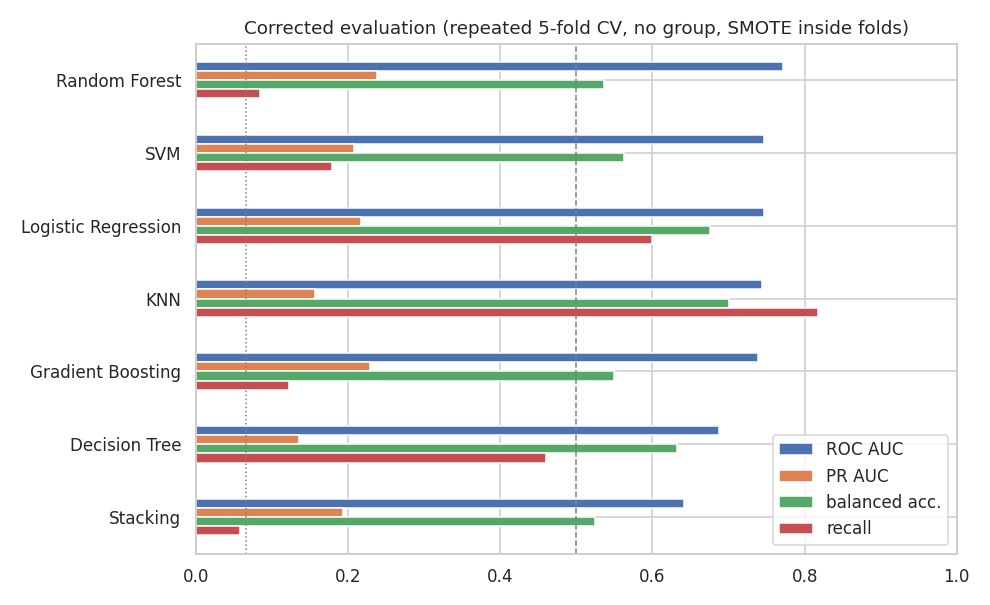
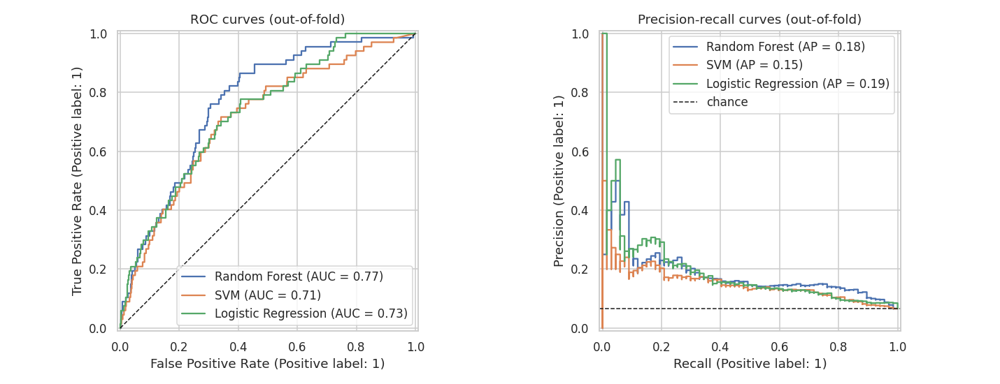
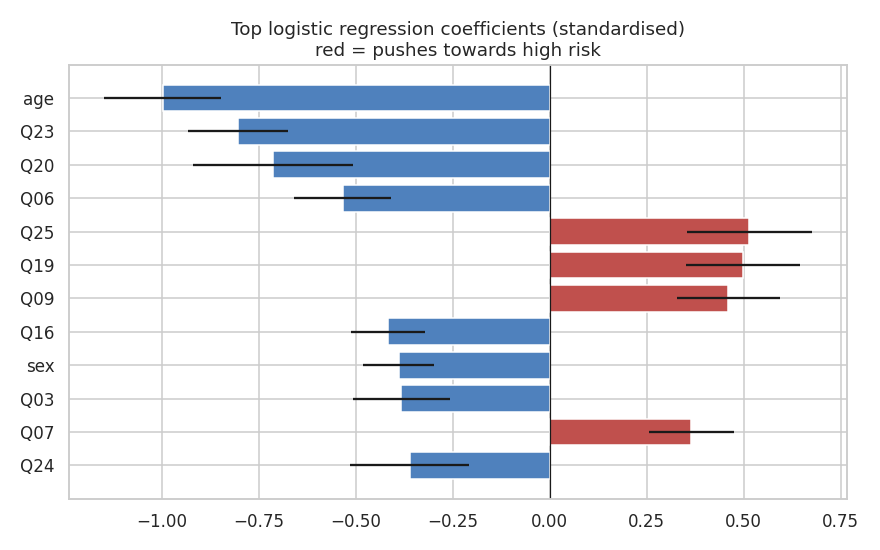
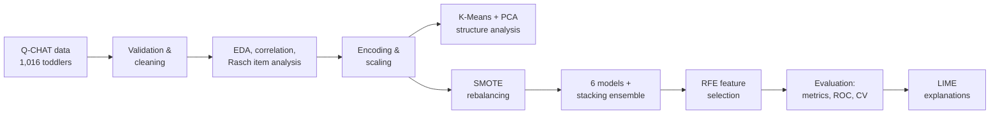

# 🧩 Early Autism Risk Detection in Toddlers with Machine Learning

**MSc Big Data Analytics dissertation (Distinction), University of Derby, 2023–24** · Supervisor: Dr Mohsen Farid
**+ 2026 re-evaluation:** finding and fixing data leakage in my own pipeline

A machine learning pipeline that classifies autism spectrum disorder (ASD) risk in toddlers from the **Q-CHAT** (Quantitative Checklist for Autism in Toddlers) screening questionnaire, with LIME explanations so clinicians can see *why* a child was flagged.

This repo tells the full story. The dissertation reported **99.2% accuracy**. When I re-audited the code, I found that two evaluation mistakes produced most of that score. I measured each one and re-ran the comparison properly. The corrected models reach a **ROC AUC of about 0.75**: genuine but modest signal, and a much more honest basis for a screening tool.

**Tools:** Python · pandas · scikit-learn · imbalanced-learn (SMOTE, pipelines) · LIME · Matplotlib · Seaborn · Jupyter

---

## Notebooks

| Notebook | What it contains |
|---|---|
| [`01_original_dissertation_analysis.ipynb`](notebooks/01_original_dissertation_analysis.ipynb) | The analysis as submitted in 2024: EDA, Rasch item analysis, K-Means + PCA, 6 classifiers + stacking, RFE feature selection, LIME |
| [`02_corrected_evaluation.ipynb`](notebooks/02_corrected_evaluation.ipynb) | Leakage audit and corrected benchmark: label leakage check, SMOTE ablation, repeated cross-validation, PR curves, screening threshold, feature effects |

---

## What went wrong in the original evaluation

**1. The `group` column *was* the label.** Every child in diagnostic group 2 is high risk, and every child in groups 1, 3 and 4 is low risk. A one-line rule (`group == 2`) scores 100% accuracy with no model at all.

**2. SMOTE ran before the train/test split.** The whole dataset was oversampled from 67 to 949 high-risk cases, then split. The test set (190 vs 190) was therefore mostly *synthetic* minority cases, interpolated from the same points the model trained on.

The ablation in notebook 02 shows that **SMOTE-before-split was the bigger problem**. Even with `group` removed, it still produces near-perfect scores:

| Features | SMOTE | Accuracy | Recall | ROC AUC |
|---|---|---|---|---|
| with `group` | before split (original) | 0.979 | 0.979 | 0.999 |
| without `group` | before split | 0.976 | 0.963 | 0.997 |
| with `group` | inside pipeline | 0.926 | 0.077 | 0.874 |
| **without `group`** | **inside pipeline (correct)** | 0.926 | 0.077 | **0.715** |

*(SVM, 80/20 split. In the corrected rows the test set is real and imbalanced: 13 high-risk vs 191 low-risk children.)*

## Corrected results

Features: sex, age, total Q-CHAT score and the 25 items. Scaling and SMOTE are fitted inside each training fold. Results are averaged over **5-fold stratified cross-validation repeated 5 times**, because a single test set holds only ~13 high-risk children.

| Model | ROC AUC | PR AUC | Balanced accuracy | Recall @0.5 |
|---|---|---|---|---|
| Random Forest | **0.772** | **0.238** | 0.537 | 0.085 |
| Logistic Regression | 0.746 | 0.217 | 0.676 | 0.599 |
| SVM | 0.746 | 0.208 | 0.563 | 0.179 |
| KNN | 0.744 | 0.157 | **0.701** | **0.818** |
| Gradient Boosting | 0.739 | 0.229 | 0.550 | 0.123 |
| Decision Tree | 0.687 | 0.135 | 0.632 | 0.460 |
| Stacking | 0.641 | 0.194 | 0.524 | 0.058 |

*Chance level: ROC AUC 0.5, PR AUC 0.066 (the share of high-risk children).*



**As a screening tool:** tuning the Random Forest threshold to catch **80% of high-risk children (54 of 67)** gives a specificity of 65%, meaning about 1 in 3 low-risk children would be flagged for follow-up. That is useful for prioritising assessments, but nowhere near a diagnostic tool.



**Which inputs matter:** the child's age and items **Q23** (twiddles objects repetitively), **Q20** (unusual finger movements) and **Q06** (pointing to share interest) carry the most consistent signal. Q20 and Q23 were also top features in the original analysis.



---

## The original dissertation analysis (2024)

<details>
<summary>Pipeline, results as reported, and LIME explanations</summary>



The dataset ([Niedźwiecka & Pisula, 2022](https://doi.org/10.3390/ijerph19053072)) has 1,016 toddlers, 949 low risk and 67 high risk (a 14:1 imbalance).


**Results as reported** (test set drawn from SMOTE-balanced data, features include `group`). Treat these as inflated; see above.

| Model | Accuracy (all features) | Accuracy (after RFE) | ROC AUC (after RFE) |
|---|---|---|---|
| SVM | 0.968 | 0.992 | 0.999 |
| Random Forest | 0.963 | 0.963 | 0.993 |
| KNN | 0.887 | 0.939 | 0.984 |
| Gradient Boosting | 0.939 | 0.937 | 0.985 |
| Decision Tree | 0.903 | 0.913 | 0.913 |
| Logistic Regression | 0.858 | 0.842 | 0.853 |
| Stacking | – | 0.989 | 1.000 |


Feature importance averaged across five models:


LIME explanation for one high-risk prediction (SVM):


</details>

---

## What I learned

- **Check your evaluation before celebrating your model.** A 99% score on a messy, imbalanced medical dataset should prompt questions, not a headline.
- **Resampling belongs inside the cross-validation loop.** SMOTE, scaling and feature selection must only ever see training data.
- **Audit features for proxies of the label.** Administrative columns like `group` can encode the outcome directly.
- **Pick metrics that match the problem.** At 6.6% prevalence, a model that always says "low risk" is 93% accurate. PR AUC and recall at a chosen threshold are far more informative.

This audit also led to my current research interest: how data handling choices such as oversampling, label noise and **data poisoning** can silently distort what a model learns. The follow-up study is in [smote-data-poisoning](https://github.com/JerryD19/smote-data-poisoning).

---

## Repository structure

```
├── notebooks/
│   ├── 01_original_dissertation_analysis.ipynb
│   └── 02_corrected_evaluation.ipynb
├── data/                 # place Qchat_Full_Polish_Cleaned.csv here (not included)
├── images/               # figures used in this README
├── report/dissertation.pdf
└── requirements.txt
```

**To run:** `pip install -r requirements.txt`, add the dataset to `data/`, then open the notebooks.

## Citation

Dibie, J. C. (2024). *Detection of Autism in Toddlers Using Machine Learning*. MSc dissertation, University of Derby.
